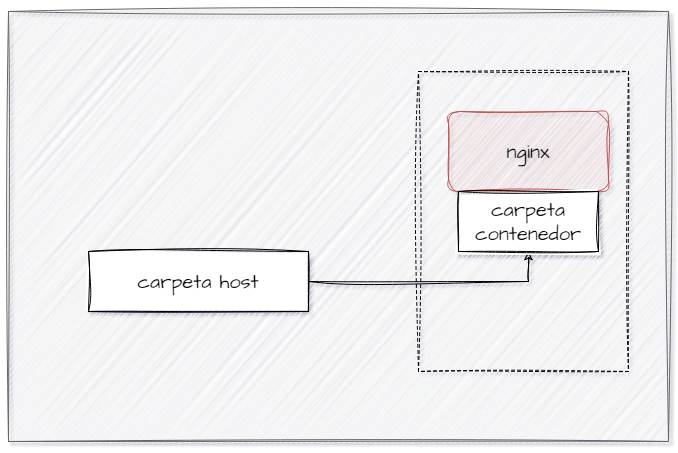

# BIND MOUNT
En un bind mount mapeamos (montar) un directorio o archivo específico del sistema de archivos del host con una parte del sistema de ficheros del contenedor.

```
docker run -d --name <nombre contenedor> -v <ruta carpeta host>:<ruta carpeta contenedor> <imagen> 
```
ó
```
docker run -d --name <nombre contenedor> --mount type=bind,source=<ruta carpeta host>,target=<ruta carpeta contenedor> <imagen>
```
- destination, dst, target: La ruta donde se monta el archivo o directorio en el contenedor.
- source, src: El origen del montaje.
  
### En tu computador crear una carpeta llamada nginx y dentro de esta carpeta crea otra llamada html. Como se aprecia en la figura.


### Crear un contenedor con la imagen nginx:alpine, mapear todos por puertos, para la ruta carpeta host colocar el directorio en donde se encuentra la carpeta html en tu computador y para la ruta carpeta contenedor: /usr/share/nginx/html (esta ruta se obtiene al revisar la documentación de la imagen)

# COMPLETAR CON EL COMANDO

### ¿Qué sucede al ingresar al servidor de nginx?
Al ingresar al contenedor de la imagen, aparece como 403 forbidden, dado que no esta presente un archivo para mostrar en la carpeta host


### ¿Qué pasa con el archivo index.html del contenedor?
Dado que el contenedor apunta al host con la carpeta share para mostrar el archivo index.html, no existe un archivo index.html contenido den el contenedor, revisando la ruta que apunta en el contenerdor se visualiza que no existe un archivo presente.


### Ir a https://html5up.net/ y descargar un template gratuito, descomprirlo dentro de tu computador en la carpeta html
### ¿Qué sucede al ingresar al servidor de nginx?
Una ves extraida y que lea el archivo raiz desde el host, ya se visualiza efectivamente el contenido en el contenedor. 


### Eliminar el contenedor

```
docker rm nginx_redirect_host
```

### ¿Qué sucede al crear nuevamente un contenedor montado al directorio definidos anteriormente?
Al crear nuevamente un contenedor montado al mismo directorio, se genera un contenedor nuevo e independiente, pero el contenido de la carpeta del host persiste. El contenedor seguirá mostrando el mismo resultado anterior: si el directorio host contiene archivos index.html, Nginx los servirá; si está vacío, se mostrará un error 403 Forbidden.


